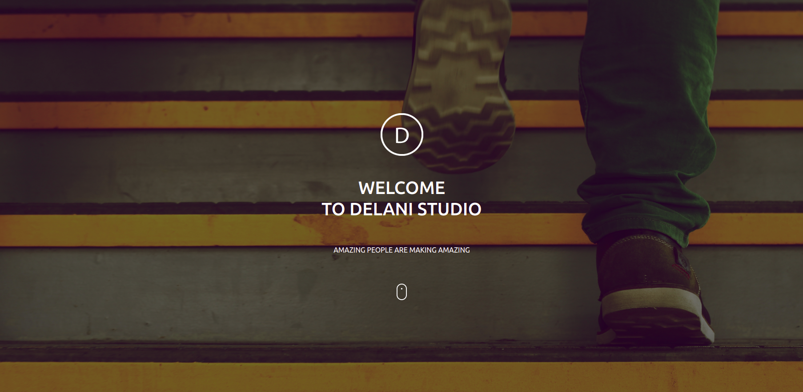

# DELANI STUDIO
## Author.
### *Tamminga Budds*(18/04/2021)

## Description
This website  is about a company that deals with design,product management and offers soft solutions to organisations.This project mainly focused on the structure of the page and interaction of the webpage.[website](https://budds300.github.io/Delani-Studio/)
## How To Access
You can access it by copying  the [repository](https://github.com/budds300/Delani-Studio) and setting it up in your local machine by following the steps below .
After copying the  repo link  paste it on the terminal 
```
$ git clone <repo-link>
```
you then go to the directory/folder of the project you just cloned
```
$ cd  directory
```
You then type  code . for Vs code or [atom .]() for atom IDE then press enter  and you are ready to go
```
$ code .
```
## Langueges used
* HTML
* CSS
* JavaScript
* Bootstrap
* Git
## Known Bugs
There are no known bugs. Contact budds300@gmail.com in case of any.
## License
The content ofthis site is license under the MIT license Copyright [LICENSE](LICENSE) (c) 2021 **Tamminga**


